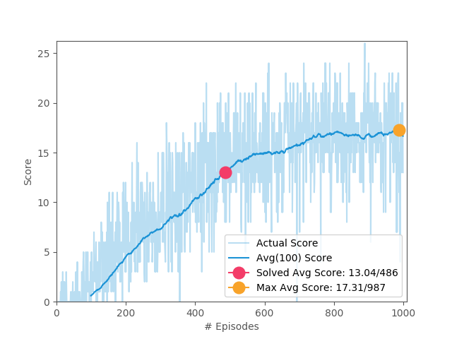

# DRLND Project Navigation Report: Unity Banana Environment

## Summary

* Solved in 518 episodes.
* Algorithms implemented
   - [Deep Q Learning](#learning-algorithm)
   - [Dueling Deep Q Learning](#dueling-dqn-model)
   - [Double Deep Q Learning](#double-dqn)
   - [Prioritized Experience Replay](#prioritized-experience-replay)
* Trained Agent Playing


## Source Code
1. [dqn_agent.py](rl/agent/dqn/dqn_agent.py): The main learning algorithm.
2. [dqn_model_torch.py](rl/agent/dqn/dqn_model_torch.py): Torch implementation of DQN models. `DqnModel`, `DuelingDqnModel`, `DqnConvModel`, `DuelingDqnConvModel`
3. [simulator.py](rl/simulator.py): The code which emulates the training process.
4. [prioritized_replay_buffer.py](rl/util/prioritized_replay_buffer.py): Implementation of Prioritized Experience Replay.
5. [priority_queue.py](rl/util/priority_queue.py): SumTree implementation, taken from [here](https://github.com/jaara/AI-blog/blob/master/SumTree.py).

## [Learning Algorithm](#learning-algorithm)

1. Create a [PrioritizedReplayBuffer](#prioritized-experience-replay) to record every interaction the agent does as an `Experience(state, action, reward, next_state, done)`
2. Initialize two networks named `local` and `target`, of type [Dueling DQN](#dueling-dqn-model).
3. For every episode
    1. reset the environment, and record the state
    2. While environment is not done:
        1. Use ε-greedy method to get the action, use the `target` network for exploitation [(Double DQN)](#double-dqn).
        2. Interact with the environment with the above mentioned action
        3. Record the `Experience` to the `ReplayBuffer`
        4. After every 4th step, learn if we have minimum of `batch_size` experiences in buffer.
            1. Sample `batch_size` `Experiences` from the buffer (based on priority).
            2. Compute `Qsa_expected = rewards + gamma * max(target(next_states))`
            3. Compute `TD_error = mean-square-error(Qsa_expected - local(states)[actions])`
            4. Back propogate `TD_error` on the `local` network
            5. Copy the weights from `local` network to `target` network. ([Fixed Target Network](#fixed-target-network)).
        5. If `done`, terminate this episode.
    3. If average score of last 100 episodes >= solved_score, terminate training.

***

## Algorithm Details

## [Fixed Target Network](#fixed-target-network)

_Problem it solves:_ **Chasing a moving target.**

If we use a single network to train and to guess rewards, the behaviour will have huge oscillations.
Philosophically its better to observe the big picture, and add up the recent learning to our already attuned model.

`θ_target = τ * θ_local + (1 - τ) * θ_target`
 
`(τ = 0.001)`

The above equation here means, keep majority of our old learning from `θ_target` and add a very little portion of our recent learning `θ_local`.

_Reference_: [Human-level control through deep reinforcement learning](https://web.stanford.edu/class/psych209/Readings/MnihEtAlHassibis15NatureControlDeepRL.pdf)

## [Dueling DQN Architecture](#dueling-dqn-model)

_Problem it solves:_ **Not every states are equally valuable to be considered.**

Environments has some states where a wrong action can impact the reward heavily, where as in some states,
no matter what action we take, it really doesn't matter.

The previous single stream DQN architecture was not able to address this issue. 

This architecture, whereas separates two different streams to representation of state values 
and action advantages. Combined back with an aggregation function.


```
fc1_units = 64
fc2_units = 32
fc3_units = 32
fc4_units = 32
```

_Reference_: [Dueling Network Architectures for Deep Reinforcement Learning](https://arxiv.org/abs/1511.06581)

## [Prioritized Experience Replay](#prioritized-experience-replay)

_Problem it solves:_ **Not every Experience delivers an equally good lesson.**

A plain `ReplayBuffer` weighs every `Experience` equally while sampling. 
Not all `Experiences` are equal, and sometimes they are very rare.

This method addresses the issue, by sorting the `Experiences` by amount of `Error` that it generates during the learning process,
and then constructing a batch of all equally segmented priorities.

(The implementation also contains Importance Sampling as mentioned in the paper, 
but it seems to be buggy. Need to fix it.)

PS: An efficient implementation of the priority queue is taken from [SumTree](https://github.com/jaara/AI-blog/blob/master/SumTree.py)

_Reference_: [Prioritized Experience Replay](https://arxiv.org/abs/1511.05952)

## [Double DQN Learning](#double-dqn)

_Problem it solves:_ **Overestimation of Q values.**

During learning, not every states and actions are explored equally, 
this may cause the network to generate favoritism towards highly explored ones.
This issue is more severe at the beginning of the learning process.

To solve this issue, rather than relying on one network, we use two networks.
1. The `local` network guesses the action, based on maximum action value.
2. The TD target is computed with a `target` network's action value estimate for above action.

   

_Reference_: [Deep Reinforcement Learning with Double Q-learning](https://arxiv.org/abs/1509.06461)

***

## Hyper Parameters
```
epsilon_min = 0.01
epsilon_decay = 0.995
optimizer = Adam(learning_rate = 5e-4)
gamma = 0.99
tau = 1e-3
batch_size = 64
buffer_size = int(1e5)
update_every = 4
```

## Results

The environment is solved in 486 episodes, with a score of 13.04. Reaching a max of 17.31 in 987 episodes.

### Plot of Rewards


### Logs


```
Solved with a score of 13.04 in 486 episodes.

...
DEBUG:simulator.py:[Training 480/1000 episodes] ε: 0.0906, Best: 12.90, Avg: 12.90, Steps: 300
DEBUG:simulator.py:[Training 481/1000 episodes] ε: 0.0902, Best: 12.97, Avg: 12.97, Steps: 300
DEBUG:simulator.py:[Training 482/1000 episodes] ε: 0.0897, Best: 12.97, Avg: 12.96, Steps: 300
DEBUG:simulator.py:[Training 483/1000 episodes] ε: 0.0893, Best: 12.97, Avg: 12.92, Steps: 300
DEBUG:simulator.py:[Training 484/1000 episodes] ε: 0.0888, Best: 12.97, Avg: 12.91, Steps: 300
DEBUG:simulator.py:[Training 485/1000 episodes] ε: 0.0884, Best: 12.97, Avg: 12.92, Steps: 300
DEBUG:simulator.py:[Training 486/1000 episodes] ε: 0.0879, Best: 13.04, Avg: 13.04, Steps: 300
...
```

```
Max score of 17.31 in 987 episodes.

...
DEBUG:simulator.py:[Training 983/1000 episodes] ε: 0.0100, Best: 17.23, Avg: 17.15, Steps: 300
DEBUG:simulator.py:[Training 984/1000 episodes] ε: 0.0100, Best: 17.23, Avg: 17.13, Steps: 300
DEBUG:simulator.py:[Training 985/1000 episodes] ε: 0.0100, Best: 17.23, Avg: 17.17, Steps: 300
DEBUG:simulator.py:[Training 986/1000 episodes] ε: 0.0100, Best: 17.29, Avg: 17.29, Steps: 300
DEBUG:simulator.py:[Training 987/1000 episodes] ε: 0.0100, Best: 17.31, Avg: 17.31, Steps: 300
DEBUG:simulator.py:[Training 988/1000 episodes] ε: 0.0100, Best: 17.31, Avg: 17.25, Steps: 300
DEBUG:simulator.py:[Training 989/1000 episodes] ε: 0.0100, Best: 17.31, Avg: 17.12, Steps: 300
...
```

Checkout the full log file [here](reports/banana/2018-09-03.log)


## Ideas for Future Work

1. Compare the effects of various algorithms on learning speed.
2. Use `DuelingDqnCNNModel` to solve VisualBanana problem. Learning from seeing whats visible in terms of pixels.
3. Try out various Atari like visual environments.
4. Apply improved algorithms.